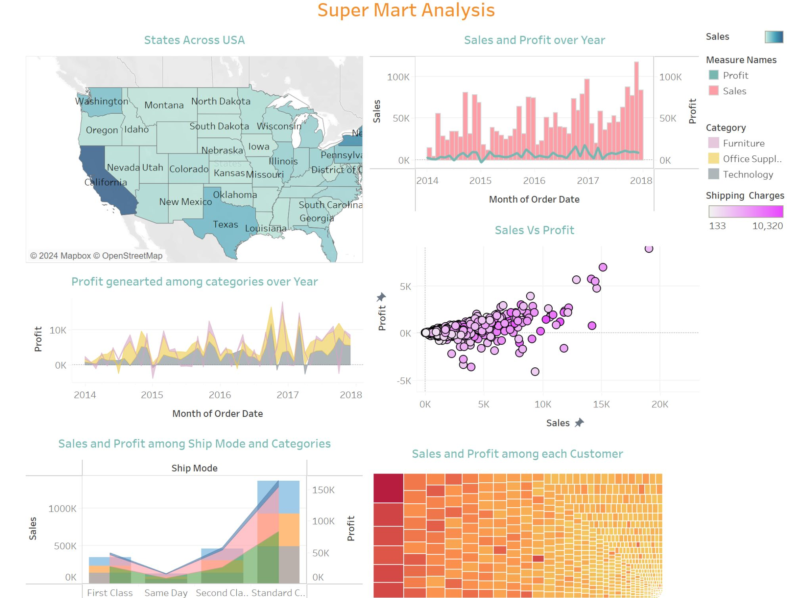

# Super Mart Analysis



## Overview
This project is a comprehensive data analysis of a supermarket's sales data, focusing on identifying key business insights, customer behavior patterns, and product performance metrics. The analysis helps in understanding sales trends, customer preferences, and product profitability.

## Features
- **Sales Analysis**: Detailed analysis of sales patterns across different time periods
- **Product Performance**: Identification of best-selling products and categories
- **Customer Insights**: Analysis of customer purchasing behavior and preferences
- **Profitability Analysis**: Evaluation of product and category profitability
- **Interactive Dashboards**: Visual representation of key metrics and insights

## Technologies Used
- **Tableau**: For data visualization and dashboard creation
- **Data Analytics**: Advanced analytics techniques for deriving insights
- **Data Visualization**: Interactive charts and graphs for better understanding

## Project Structure
```
SuperMartAnalysis/
├── data/                  # Raw and processed data files
├── dashboards/           # Tableau dashboard files
├── analysis/             # Analysis documentation
└── README.md            # Project documentation
```

## Key Insights
1. **Top Performing Products**
   - Identification of best-selling items
   - Analysis of product categories with highest revenue

2. **Customer Segmentation**
   - Customer behavior patterns
   - Purchase frequency analysis
   - Customer value analysis

3. **Sales Trends**
   - Seasonal patterns
   - Time-based analysis
   - Regional performance

## Dashboard Screenshots

### Sales Overview

*Comprehensive view of sales metrics and trends*

### Product Analysis

*Detailed product performance and category analysis*

### Customer Insights

*Customer behavior and segmentation analysis*

## Getting Started

### Prerequisites
- Tableau Desktop (for viewing dashboards)
- Basic understanding of data analysis concepts

### Installation
1. Clone the repository:
   ```bash
   git clone https://github.com/AnjaneyuluChinni/SuperMartAnalysis.git
   ```
2. Open the Tableau dashboard files in Tableau Desktop

## Usage
1. Open the Tableau dashboard files
2. Navigate through different sheets for specific insights
3. Use filters to analyze specific time periods or product categories
4. Export reports as needed

## Results
The analysis provides actionable insights for:
- Inventory management
- Marketing strategy
- Customer relationship management
- Product placement optimization

## Contributing
Feel free to fork this project and submit pull requests for any improvements.

## License
This project is licensed under the MIT License - see the LICENSE file for details.

## Contact
- GitHub: [@AnjaneyuluChinni](https://github.com/AnjaneyuluChinni)
- LinkedIn: [Anjaneyulu Chinni](https://www.linkedin.com/in/anjaneyulu-chinni-3a963a266/)

## Acknowledgments
- Thanks to all contributors who have helped in improving this project
- Special thanks to the data providers and stakeholders
